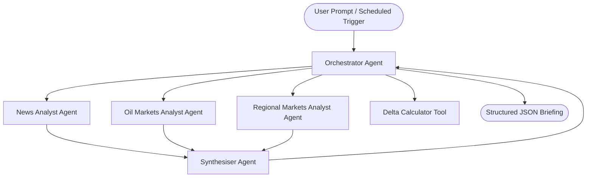

# Specification: Conflict Economics Intelligence Dashboard

This specification outlines the architecture, roles, constraints, and success criteria for the multi-agent geopolitical financial/economic impact tracker.

## System Architecture

The tracker is implemented as a multi-agent delegation system using the Google Agent Development Kit (ADK). The architecture consists of an **Orchestrator Agent** coordinating four specialist sub-agents:

---

## 1. Orchestrator Agent
### Purpose
Coordinates the briefing generation cycle, triggers data collection, runs historical delta checks, and presents the final structured JSON briefing.

### Capabilities & Tools
- **`calculate_deltas`**: Compares current metrics against `history/briefings.json`.
- **Sub-Agent Delegation**: Routes execution sequentially to the specialist sub-agents.

### Constraints
- Must enforce a strict output structure.
- Must handle API rate limit errors gracefully using cache/mock fallbacks.
- Must focus solely on conflict-related economic indicators, avoiding military/political speculation.

---

## 2. News Analyst Agent
### Purpose
Queries NewsAPI and Brave Search MCP to find and summarize major news events regarding the geopolitical situation in the Middle East and its economic/market impacts.

### Capabilities & Tools
- **`fetch_news_impact`**: Queries NewsAPI and Brave Search.
- Summarizes events focusing strictly on economic aspects (e.g. shipping route disruptions, sanctions, refinery shutdowns).

### Constraints
- Avoid analyzing military tactics, casualties, or political statements unless they have a direct market impact.
- Rate limits must be managed via local caching.

---

## 3. Oil Markets Analyst Agent
### Purpose
Tracks Brent and WTI crude prices, global energy sectors, and identifies price movements linked to geopolitical escalations.

### Capabilities & Tools
- **`fetch_oil_markets`**: Pulls commodity prices via `yfinance` or Alpha Vantage.
- Computes standard moving averages and basic trends.

### Constraints
- Do not make price predictions or speculative forecasts (e.g., "oil will reach $120"). Frame findings as "market concerns" or "analyst sentiment".

---

## 4. Regional Markets Analyst Agent
### Purpose
Monitors major Middle East stock indices (TADAWUL, TA-35, EGX, QE Index) to gauge regional market sentiment.

### Capabilities & Tools
- **`fetch_regional_indices`**: Pulls index levels, daily changes, and trends via `yfinance`.

### Constraints
- Report only historical price movements and verified market commentary. Avoid speculation on regional stability.

---

## 5. Synthesiser Agent
### Purpose
Connects the dots between news, oil prices, and regional market indices. Synthesizes findings into a unified briefing and formats it into the final JSON schema.

### Capabilities
- Synthesizes qualitative news themes with quantitative market changes.
- Formats output conforming to the `ConflictBriefing` schema.

---

## Final Briefing Output Schema (JSON)
The agent outputs a structured JSON object containing:
- `timestamp`: UTC execution timestamp.
- `news_summary`: List of major economic headlines with impact ratings (High/Medium/Low).
- `oil_market`: Current Brent and WTI prices, daily changes, and basic trend descriptors.
- `regional_indices`: Current levels and daily percentage changes for TADAWUL, TA-35, EGX, and QE Index.
- `global_indicators`: Safe-haven assets (Gold/USD index changes) and shipping indicators.
- `deltas`: Daily/weekly changes computed from `history/briefings.json`.
- `sentiment_index`: A consolidated "conflict economics sentiment score" (1-10 scale, where 10 is high market concern/disruption).
