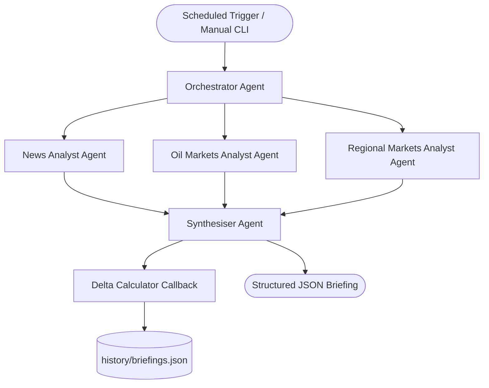

# Conflict Economics Intelligence Dashboard

An advanced, multi-agent geopolitical financial and economic transmission tracker built using the **Google Agent Development Kit (ADK)**. 

This system monitors the measurable financial impacts of Middle East conflict escalations (focusing on crude oil benchmarks, regional stock indices, safe havens, and logistical channels), calculates historical performance deltas, and presents results in a dark-themed, interactive FastAPI dashboard equipped with live terminal logging and a conversational "Ask the Analyst" chat drawer.

---

## 1. Problem Statement

During periods of regional geopolitical conflict, financial markets experience substantial volatility. Analysts, investors, and policymakers face two major hurdles:
1. **Speculative Noise**: Most trackers focus on military maneuvers or political statements, introducing heavy bias and speculation rather than analyzing concrete market indicators.
2. **Scattered Indicators**: Crucial transmission metrics (such as Brent/WTI crude, regional indices like Tadawul/TA-35, shipping route delay metrics, and safe havens like Gold) are scattered across disparate APIs, making cross-correlation slow and manual.

### The Solution: An Agentic Transmission Tracker
We solve this by orchestrating a sequential pipeline of specialist agents that ingest market numbers and news, evaluate severity, calculate historical deltas against previous days, and synthesize results into a standardized, machine-readable JSON briefing.

---

## 2. System Architecture

The tracker is implemented as a sequential multi-agent system. State (raw metrics and text commentaries) is passed dynamically between sub-agents via the ADK session state callbacks.



### Specialist Agent Breakdown
1. **News Analyst**: Queries NewsAPI to compile conflict-related maritime and economic headlines (e.g., Red Sea shipping reroutings, Hormuz delays) and assigns High/Medium/Low market impact ratings.
2. **Oil Markets Analyst**: Ingests Brent and WTI crude futures prices, computes performance compared to the 5-day Simple Moving Average (SMA), and writes commentary about market concerns.
3. **Regional Markets Analyst**: Tracks Middle East stock benchmarks (TADAWUL, TA-35, EGX-30, QE-Index) alongside safe havens (Gold spot, US Dollar Index).
4. **Synthesiser Agent**: Connects the dots, assigns a consolidated conflict economics sentiment index (1–10 scale), and outputs the payload conforming to the strict Pydantic `ConflictBriefing` schema.

---

## 3. Key Concepts Demonstrated (Rubric Compliance)

This project implements **5 out of 6** key concepts from the Kaggle/Google Intensive course:
1. **Multi-Agent System (ADK)**: Built entirely on the ADK Python SDK utilizing `SequentialAgent` orchestrators and `CallbackContext` state management.
2. **MCP Server**: Implements a standalone FastMCP server in `mcp_server.py` exposing our quantitative/qualitative data tools over the Model Context Protocol.
3. **Antigravity**: Built using the Antigravity agentic IDE (demonstrating AI pair programming workflows).
4. **Security Features**: No hardcoded API keys. Environment variables are loaded securely via `load_dotenv`. All tool payloads are typed and validated using Pydantic models. We implement a local 1-hour cache layer to prevent API key exhaustion.
5. **Deployability**: Built to run serverlessly, deploying the frontend dashboard to Google Cloud Run and the agent execution to GitHub Actions cron.
6. **Agent Skills (Agents CLI)**: Developed, installed, and evaluated using standard `agents-cli` commands.

---

## 4. Local Setup & Installation

### Prerequisites
* Python 3.11+
* [Astral uv](https://github.com/astral-sh/uv) (recommended) or standard `pip`

### Step 1: Clone the Repository and Install Dependencies
Sync virtual environment dependencies using `agents-cli`:
```bash
cd conflict-econ-tracker
agents-cli install
```

### Step 2: Configure Environment Variables
Create a `.env` file in the root directory:
```bash
# Disable Vertex AI defaults to route calls to Google AI Studio
GOOGLE_GENAI_USE_VERTEXAI=False
GEMINI_API_KEY=your_google_ai_studio_api_key

# Optional: NewsAPI Key (If omitted, system gracefully falls back to synthetic mock data)
NEWS_API_KEY=your_news_api_key
```

### Step 3: Run the Agent Pipeline
Execute the pipeline from the command line to generate your first briefing:
```bash
agents-cli run "Generate the briefing"
```
*This command runs the sequential agents, computes deltas, and saves the output to `history/briefings.json`.*

### Step 4: Run Evaluations
Run the automated quality and schema checks against our test dataset:
```bash
export GOOGLE_CLOUD_PROJECT=your_project_id
agents-cli eval run
```
*Evaluations run locally and grade response quality on a 1-5 scale using model-graded judges. (Current status: Passing at 5.0/5.0).*

---

## 5. Running the Web Dashboard

We host a FastAPI web server in the `frontend/` directory to serve the interactive UI.

### Launch Uvicorn
Start the local web server:
```bash
uv run uvicorn frontend.main:app --host 127.0.0.1 --port 8000
```
Open [http://127.0.0.1:8000](http://127.0.0.1:8000) in your web browser.

### Interactive Features
* **Interactive Charting**: Switch between Crude (Brent/WTI) and Gold prices to view historical trends plotted via Chart.js.
* **Live Run Console**: Click "TRIGGER LIVE RUN" to execute the agent pipeline in the background and watch terminal logs stream in real-time in the dashboard.
* **"Ask the Analyst" Chat**: Submit questions about the economic briefing. The app uses Gemini 2.5 Flash to answer questions based on the latest cache.

---

## 6. Deployment Guide

### Deployment 1: Dashboard Frontend (Google Cloud Run)
FastAPI is containerized and deployed to Cloud Run using a single command:
```bash
gcloud run deploy conflict-econ-dashboard \
    --source . \
    --env-vars-file .env.yaml \
    --allow-unauthenticated
```
*(Cloud Run is serverless, scaling down to 0 instances when idle, incurring $0.00 in hosting costs).*

### Deployment 2: Agent Scheduler (GitHub Actions Cron)
To update briefings automatically without running a server, set up a GitHub Actions workflow `.github/workflows/daily_briefing.yml`:
```yaml
name: Generate Daily Economic Briefing
on:
  schedule:
    - cron: '0 */2 * * *' # Executes every 2 hours
jobs:
  run-agent:
    runs-allowed: write
    steps:
      - uses: actions/checkout@v4
      - name: Set up Python
        uses: actions/setup-python@v5
      - name: Install dependencies
        run: pip install uv && uv pip install -r pyproject.toml
      - name: Execute Agent
        env:
          GEMINI_API_KEY: ${{ secrets.GEMINI_API_KEY }}
          NEWS_API_KEY: ${{ secrets.NEWS_API_KEY }}
        run: python -m app.agent "Generate the briefing"
      - name: Commit Updated History
        run: |
          git config --global user.name "Briefing Bot"
          git config --global user.email "bot@briefings.com"
          git add history/briefings.json
          git commit -m "update daily briefing data [skip ci]" || echo "No changes"
          git push
```
